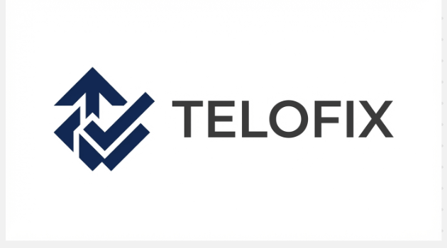

# 🤖 Telofix: Autonomous AI Bug Resolver (Level-1 Developer)

[](https://opensource.org/licenses/Apache-2.0)
[](http://makeapullrequest.com)

**Telofix** is an enterprise-grade, autonomous AI agent that acts as a "Level-1 Developer." It seamlessly integrates with your project management board (Jira), automatically clones the target repository, investigates bug reports, writes code to fix them, verifies the fix against your test suite, and pushes the changes for review.

## 🚀 Architecture

Telofix is a lightweight, purely Python-based microservice:
1. **The Gateway (FastAPI):** A lightning-fast web server that receives webhooks from Jira, manages concurrency, and safely spins up the agent in a background process.
2. **The Agent (LangGraph + GPT-4o):** A cyclic reasoning loop. The agent clones the code into an isolated sandbox, reads the buggy files, applies a fix, and runs tests. It loops until tests pass, then updates Jira.
3. **The Polyglot Workers (LangGraph + GPT-4o):** Independent, containerized AI agents.
    ###### 3.1. Java Worker:Optimized for Spring Boot, Maven, and JUnit.
    ###### 3.2. Data Worker: Optimized for Python scripts, MongoDB migrations, and SQL cleanup.
4. **Context Rehydration (Postgres):** A "State Ledger" that stores token usage, execution time, and Smart Memory (remembering which files were modified in previous runs to save costs).
## 🛠 Prerequisites

* **Docker & Docker Compose** (Highly recommended for full stack)
* **Python 3.9+**
* An **OpenAI API Key**
* A **Jira Cloud** account
* A **Git Provider** account (GitHub/Bitbucket/GitLab)
* **PostgreSQL** (Included in Docker Compose)
* **Apache Kafka** (Included in Docker Compose)

## ⚙️ Quick Start

**1. Clone the repository**
```bash
git clone [https://github.com/YOUR_USERNAME/telofix.git](https://github.com/YOUR_USERNAME/telofix.git)
cd telofix

2. Configure your Secrets
Copy the template environment file and add your actual API keys. Do not commit your real .env file to version control.
Bash
cp .env.example .env
(Open .env and fill out your OpenAI, Jira, and Git credentials).

4. Launch the Platform

Bash
docker-compose up -d --build
```

### 🧠 Smart Features
1. Prompt Registry: All AI instructions are decoupled from the code. Update prompt_registry.py to change how the agents behave across all workers instantly.

2. Cost Optimization: The agent uses "Context Rehydration" to skip expensive file discovery steps if it has worked on a ticket before.

3. Dynamic Dependency Management: The Data Worker can automatically identify, write, and install its own Python dependencies (pip install -r requirements.txt) during execution.


## 🎯 Usage (The Jira Flow)
   ##### Option 1: Jira Webhook (Automated) Map your Jira board transitions to trigger a webhook to http://<your-server>:8080/webhook/jira-trigger. When you drag a ticket to "AI-Fix", Telofix handles the rest.

   ##### Option 2: CLI Mode (Manual)
    Run the agent directly from your terminal for a specific ticket:
    python agent.py SCRUM-123

## 🤝 Contributing

We welcome contributions from the community! Whether it is adding support for new Git providers, improving the agent's prompts, or fixing bugs, your help is appreciated.

Please see our CONTRIBUTING.md for details on how to set up your dev environment, submit pull requests, and report issues.

Telofix is built to be extended! You can add a Node.js Worker, React Worker, or Go Worker by following our Polyglot Worker Standard:

1. Add a new template to prompt_registry.py.

2. Create a worker directory with a specialized tools.py (e.g., run_npm_test).

3. Add the service to docker-compose.yml listening to a new Kafka topic.

See CONTRIBUTING.md for the full SOP.
## 📄 License
This project is licensed under the Apache License 2.0 - see the  file for details.

